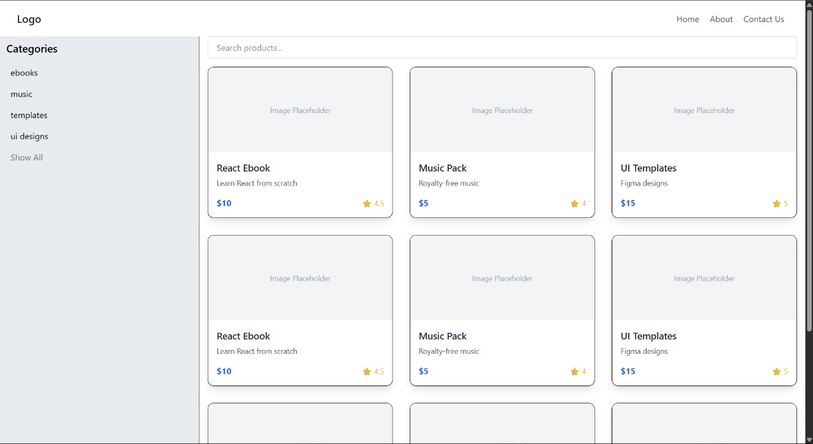
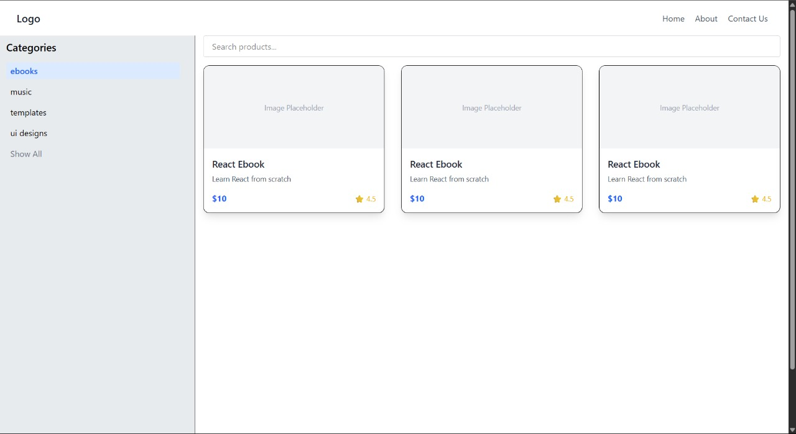
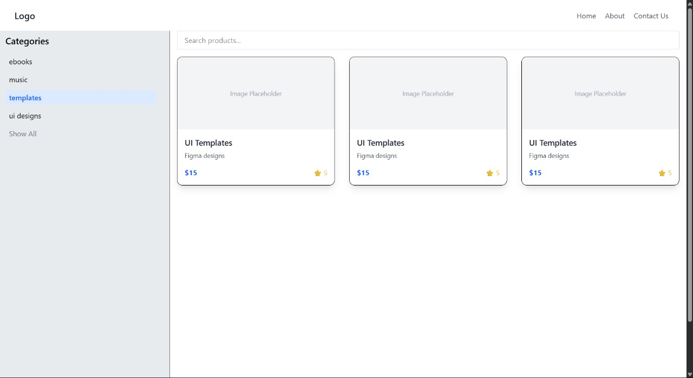

# 🛍️ Mini-Store React App

A simple React-based digital product store that lets users browse, filter, and search for items like eBooks, music, and templates. Great for learning component-based architecture and state management!


## 🚀 Features

- ✅ Product Listing  
- ✅ Filter by Category (eBooks, Music, Templates)  
- ✅ Search Products by Name  
- ✅ Rating and Description Display  
- 📦 Mock Product Data (No backend required)  


## 🧱 Tech Stack

- [React](https://reactjs.org/)
- [JavaScript](https://developer.mozilla.org/en-US/docs/Web/JavaScript)
- [CSS / Tailwind / Styled Components] (customizable based on your styling)


## 🖼️ Screenshot






## 📂 Project Structure

mini-store /

|

├── public /

│

├── src /

│ ├── components /

│ │ ├── ProductList.js

│ │ ├── CategoryFilter.js

│ │ └── SearchBar.js

│ ├── App.js

│ └── index.js

|

├── package.json

└── README.md


## 📦 Installation

```bash
# 1. Clone the repo
git clone https://github.com/jatinbalajisailada/digital-product-page

# 2. Navigate into the project
cd digital-product-page

# 3. Install dependencies
npm install

# 4. Start the development server
npm start
